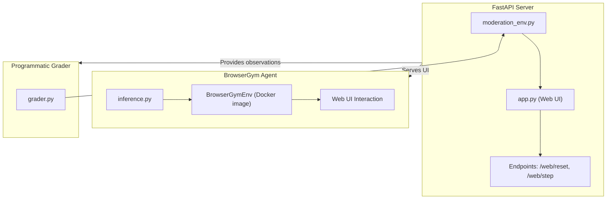

# Professional Content Moderation & Policy Enforcement (PCMPE)

A high‑fidelity **OpenEnv** reinforcement‑learning environment that simulates a real‑world content moderation pipeline.  Judges can evaluate an AI agent’s ability to:
- **Classify** content as `ALLOW`, `DELETE`, or `ESCALATE` based on policy guidelines.
- **Provide rationales** for each decision, which are scored for quality.
- **Interact** with a premium, glass‑morphic web UI (`/web`).

---

## 📐 Architecture Overview



- **`moderation_env.py`** – Core environment implementing the moderation task, reward logic, and data loading.
- **`app.py`** – FastAPI wrapper exposing the UI and HTTP endpoints.  Buttons now have stable IDs (`btn-allow`, `btn-delete`, `btn-escalate`) and the rationale textarea (`rationale-input`).
- **`inference.py`** – **BrowserGym‑compliant** inference script required by the hackathon.  It drives a browser instance, reads the UI state, fills the rationale, and clicks the appropriate button using the OpenAI client.
- **`grader.py`** – Evaluates any agent (including the baseline `GroundTruthAgent`) and reports a normalized score between 0.0 and 1.0.
- **`models.py`** – Pydantic models for actions, observations, and decisions.

---

## 🚀 Getting Started

### Prerequisites
- **Python 3.10+** (managed with `uv`).
- **Docker** (for the BrowserGym environment).  The inference script expects the Docker image `browsergym-env:latest`.
- **OpenAI / HuggingFace API key** (set as `HF_TOKEN`).
- Optional but recommended for the submission script: `browsergym` and `playwright` Python packages.

### Installation
```bash
# Clone the repository (already done)
cd treasure_env

# Install dependencies via uv (or pip)
uv pip install -r requirements.txt   # requirements.txt includes openai, numpy, pillow, etc.
# Or directly from pyproject.toml
uv pip install .
```

### Running the Environment Server
```bash
uv run server   # Starts FastAPI on http://0.0.0.0:7860
```
Open a browser and navigate to **`http://localhost:7860/web`** to explore the moderator console.

---

## 📊 Evaluation & Scoring

### Reward Function (per step)
- **Correct decision**: +10 points
- **Incorrect decision**: ‑15 points (high penalty)
- **Rationale length bonus**: +2 points if > 5 words
- **Keyword matches**: +1.5 points per matching keyword from the item’s metadata

The environment accumulates a **cumulative reward** and reports it as `current_score`.  The grader normalises the total reward to a 0‑1 score:
```
norm_score = (total_reward - min_possible) / (max_possible - min_possible)
```
Judges will run `python3 grader.py` after the agent finishes to obtain the final normalized score.

---

## 🤖 Running the Submission‑Compliant Inference Script
The hackathon mandates a **BrowserGym** agent.  The provided `inference.py` follows the required template:

1. **Set environment variables** (replace with your own keys):
```bash
export API_BASE_URL="https://router.huggingface.co/v1"
export MODEL_NAME="gpt-4o"          # or any OpenAI‑compatible model
export HF_TOKEN="your-hf-token"
```
2. **Start the server** (if not already running):
```bash
uv run server &
```
3. **Run the inference script**:
```bash
python3 inference.py
```
The script will:
- Reset the environment via `/web/reset`.
- At each step, build a prompt containing the goal, current URL, policy, content, and clickable element IDs.
- Call the LLM via the OpenAI SDK.
- Parse the LLM response into a BrowserGym action (e.g., `fill('rationale-input', '...')` then `click('btn-delete')`).
- Submit the action to the environment and repeat until the episode ends.

> **Note**: If `HF_TOKEN` is missing, the script falls back to a deterministic heuristic for local validation.

---

## 📦 Deployment to Hugging Face Spaces
The repository is already configured for Space deployment:
```bash
# From the repository root
git push huggingface main   # or the appropriate branch
```
The `Dockerfile` builds the FastAPI server; the Space will expose the UI at `https://<your‑space>.hf.space/web`.
Make sure the environment variables are added in the Space settings under **Secrets**.

---

## 🛠️ Dependencies
```toml
# pyproject.toml (relevant entries)
openenv-core[core] >= 0.2.1
numpy >= 1.24.0
pillow >= 10.0.0
openai >= 1.0.0
# BrowserGym is required for the submission script (install locally for testing)
# browsergym-env >= 0.1.0   (optional – only needed for inference.py)
```
All other runtime dependencies are listed in `requirements.txt`.

---

## 🐞 Troubleshooting
- **Port 7860 already in use** – Stop any existing server (`pkill -f uvicorn`) or change `app_port` in the front‑matter.
- **Missing API key** – The script will warn and use the heuristic fallback; set `HF_TOKEN` to avoid this.
- **Docker image not found** – Pull it manually: `docker pull ghcr.io/meta/browsergym-env:latest`.
- **`browsergym` import errors** – Install with `pip install browsergym-env` and ensure `playwright` browsers are installed (`playwright install`).

---

